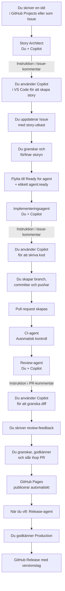

# Agentflöde för Blush & Bluff

## Översikt



## Systemarkitektur

| System eller agent | Roll | Vad den gör |
| --- | --- | --- |
| GitHub Actions | Automation | Förbereder instruktioner, kör CI-tester, hanterar branching och PR-skapande |
| GitHub Copilot (VS Code) | AI-assistent | Hjälper dig skapa stories, implementera kod och granska ändringar |
| Du | Ledare | Tar beslut, granskar resultat, godkänner ändringar och releaser |

## Arbetsgång – Steg för steg

### 1️⃣ Story Architect – Skapa en story från en idé

1. **Skapa en Issue** med en kort idé (one-liner)
   ```
   Titel: "Lägg till mörkläge"
   Beskrivning: "Användare bör kunna växla mellan ljust och mörkt tema"
   ```

2. **Lägg etikett `story:expand`** → GitHub Actions skickar instruktion till Issue-kommentar

3. **Öppna Copilot Chat** i VS Code (Cmd+I) och klistra in den automatiska prompten

4. **Kopiera resultatet** (story-utkastet) och uppdatera Issue-body

5. **Granska och förbättra** story-utkastet själv

6. **Lägg etikett `story`** när du är nöjd

### 2️⃣ Implementeringsagent – Implementera en godkänd story

1. **Lägg etikett `agent:ready`** på en godkänd story → GitHub Actions skickar instruktion

2. **Öppna Copilot Chat** i VS Code och klistra in prompten

3. **Implementera** det Copilot föreslår (eller justera det själv)

4. **Kör testerna**: `node --check app.js`

5. **Skapa branch**: `git switch -c implement/issue-123`

6. **Committa**: `git add -A && git commit -m "Implementera story #123"`

7. **Pusha**: `git push origin implement/issue-123`

8. **Skapa PR** på GitHub → CI-agent körs automatiskt

### 3️⃣ Review-agent – Granska en pull request

1. **PR skapas** → GitHub Actions genererar granskning-instruktion

2. **Öppna Copilot Chat** och använd den automatiska prompten

3. **Granska diff:n** med Copiots hjälp

4. **Kommentera på PR:n** med ditt granskningstilltänkande

5. **Du godkänner och slår ihop** när CI är grön och allt ser bra ut

### 4️⃣ Release – Skapa en produktionsrelease

1. **Gå till Actions → Release – Blush & Bluff**

2. **Kör workflowet** med önskat versionsnummer (t.ex. `1.2.0`)

3. **Godkänn i production-miljön** när den frågar

4. **GitHub Release skapas** med automatiska release notes

## Säkerhetsregler

- Lägg ALDRIG lösenord, API-nycklar eller personuppgifter i en Issue eller PR
- Lägg endast `agent:ready` på stories som du själv har granskat noga
- Du måste godkänna alla releaser – agenten kan aldrig release själv
- CI-tester måste passa innan du slår ihop PR:er
- GitHub Actions får ALDRIG ändra säkerhetskritiska filer (.github, secrets, Firebase-regler)

## Etiketter

| Etikett | Mening |
| --- | --- |
| `story:expand` | Starta Story Architect – skapa story från one-liner |
| `story` | Story är skriven och klar för implementering |
| `agent:ready` | Story är godkänd – starta implementeringsagent |
| `awaiting-story-draft` | Väntar på att du ska skapa story-utkastet |
| `awaiting-implementation` | Väntar på att du ska implementera |
| `needs-refinement` | Story behöver förtydligas innan implementation |
