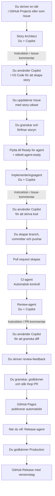

# Agentflöde för Blush & Bluff

## Översikt



## Systemarkitektur

| System eller agent | Roll | Vad den gör |
| --- | --- | --- |
| GitHub Actions | Automation | Förbereder instruktioner, kör CI-tester, hanterar branching och PR-skapande |
| GitHub Copilot (VS Code) | AI-assistent | Hjälper dig skapa stories, implementera kod och granska ändringar |
| Du | Ledare | Tar beslut, granskar resultat, godkänner ändringar och releaser |

## Arbetsgång – Steg för steg

### 🔄 Komplett flöde – Vad är manuellt vs automatiskt?

```
MANUELL (Du i GitHub)
   ↓ Du skapar Issue
═════════════════════════════════════════════════════════════════════
   ↓ Du applicerar "story:expand" label
   
AUTOMATISK (GitHub Actions) ⚡
   ↓ Story Architect startar omedelbar
   ├─ Analyserar issue-titeln
   ├─ Genererar smart story-struktur
   ├─ Uppdaterar Issue-body
   └─ Lägger "awaiting-story-review" label
═════════════════════════════════════════════════════════════════════
MANUELL (Du i GitHub & VS Code)
   ├─ Du läser och granskar story-utkastet
   ├─ Du redigerar delar i Issue-body om behövas
   ├─ Du applicerar "story" label när approved
   └─ Du applicerar "agent:ready" label när redo att implementera
   
AUTOMATISK (GitHub Actions) ⚡
   ├─ Agent Implement startar omedelbar
   ├─ Skapar kommentar med:
   │  ├─ Hela story-texten
   │  └─ Instruktioner för git branching
   └─ Lägger "awaiting-implementation" label
═════════════════════════════════════════════════════════════════════
MANUELL (Du i VS Code)
   ├─ Öppnar Copilot Chat
   ├─ Kopierar story-texten från GitHub-kommentaren
   ├─ Skriver prompt till Copilot
   ├─ Implementerar koden i VS Code
   ├─ Testar lokalt
   ├─ Granskar ändringar
   └─ Skapar git branch och pushar
   
MANUELL (Du i GitHub)
   ├─ Skapar Pull Request
   └─ Applicerar etiketter
   
AUTOMATISK (GitHub Actions) ⚡
   ├─ CI-tester körs (t.ex. linting, building)
   └─ Agent Review skapar kommentar med review-instruktioner
═════════════════════════════════════════════════════════════════════
MANUELL (Du i GitHub eller VS Code)
   ├─ Du granskar PR-koden
   ├─ Du kommenterar med feedback
   └─ Du godkänner eller begär ändringar
   
MANUELL (Du i GitHub)
   ├─ Du slår ihop PR:n
   └─ Du raderar branchen
═════════════════════════════════════════════════════════════════════
```

---

### 1️⃣ Story Architect – Automatisk story-generering

#### 📍 Var: GitHub (Issues)

| Steg | Vad | Vem | Var | Trigger |
|------|-----|-----|-----|---------|
| 1 | **MANUELL**: Skapa Issue med kort idé | Du | GitHub (Issues) | Du skapar en ny issue |
| 2 | **AUTOMATISK**: Story Architect analyserar och genererar | GitHub Actions | Körs i bakgrunden | Omedelbar när du lägger `story:expand` label |
| 3 | **MANUELL**: Granska och redigera story-utkast | Du | GitHub (Issue body) | Story är genererad |
| 4 | **MANUELL**: Applicera "story" label när godkänd | Du | GitHub (Labels) | Du är nöjd med storyn |

#### Detaljerade instruktioner:

**Steg 1️⃣ – Du skapar en Issue (MANUELL)**
- Gå till: **GitHub → Issues → New issue**
- Skriv en kort, en-radad titel:
  ```
  Idé: Lägg till mörkläge
  ```
- Beskrivning kan vara tom eller kort:
  ```
  Användare bör kunna växla mellan ljust och mörkt tema
  ```
- Klicka **Create issue**

**Steg 2️⃣ – Du applicerar `story:expand` label (MANUELL)**
- I den nya Issue, scroll ner till **Labels** på höger sida
- Klicka på **Labels**
- Välj `story:expand` från listan
- Label appliceras omedelbar

**Steg 3️⃣ – Story Architect kör (AUTOMATISK) ⚡**
- **Vad händer**: GitHub Actions `story-architect.yml` triggas omedelbar
- **Tid**: Ca 10-30 sekunder
- **Vad den gör**:
  - Läser issue-titeln
  - Detekterar typ (cleanup/bugfix/feature/refactor)
  - Genererar smart story med:
    - **Mål** (why)
    - **Bakgrund** (context)
    - **Omfattning** (scope)
    - **Utanför omfattning** (out of scope)
    - **Acceptanskriterier** (acceptance criteria)
    - **Testplan** (test plan)
    - **Risker** (risks)
    - **Öppna frågor** (open questions)
  - Uppdaterar Issue-body automatiskt
  - Skapar kommentar: "Story Architect aktiverad"
  - Lägger label `awaiting-story-review`
  - Tar bort `story:expand` label

**Steg 4️⃣ – Du granskar story-utkastet (MANUELL)**
- Läs den genererade story-texten i Issue-body
- Du kan **redigera direkt** i Issue-body om något behöver ändras
- Lägg eventuella frågor under "Öppna frågor"
- Klicka **Update issue**

**Steg 5️⃣ – Du applicerar `story` label (MANUELL)**
- Gå till **Labels** på höger sida
- Lägg till `story` label (detta markerar att storyn är godkänd)
- Du kan också ta bort `awaiting-story-review` label nu

---

### 2️⃣ Agent Implement – Automatisk implementeringsguide

#### 📍 Var: GitHub (Issues) → VS Code (Copilot) → GitHub (Terminal)

| Steg | Vad | Vem | Var | Trigger |
|------|-----|-----|-----|---------|
| 1 | **MANUELL**: Applicera `agent:ready` label | Du | GitHub (Labels) | Story är godkänd |
| 2 | **AUTOMATISK**: Agent Implement genererar guide | GitHub Actions | Körs i bakgrunden | Omedelbar när du lägger `agent:ready` label |
| 3 | **MANUELL**: Du implementerar koden | Du | VS Code (Copilot) | Guide är genererad |
| 4 | **MANUELL**: Du pushar och skapar PR | Du | VS Code + GitHub | Kod är klar |
| 5 | **AUTOMATISK**: CI-tester och Review-agent | GitHub Actions | Körs i bakgrunden | PR skapas |

#### Detaljerade instruktioner:

**Steg 1️⃣ – Du applicerar `agent:ready` label (MANUELL)**
- I Issue, gå till **Labels** på höger sida
- Lägg till `agent:ready` label
- Label appliceras omedelbar

**Steg 2️⃣ – Agent Implement genererar guide (AUTOMATISK) ⚡**
- **Vad händer**: GitHub Actions `auto-implement.yml` triggas omedelbar
- **Tid**: Ca 10-30 sekunder
- **Vad den gör**:
  - Läser hele story-texten från Issue-body
  - Detekterar issue-typ (cleanup/bugfix/feature/refactor)
  - Skapar kommentar med:
    - **Story-texten** (för att du ska ha det framför dig)
    - **Implementeringsanvisningar** baserat på story-typ:
      ```
      Steg 1: Skapa en ny branch
      git switch -c implement/issue-X
      
      Steg 2: Implementera koden enligt story
      Använd Copilot Chat för att generera kod
      
      Steg 3: Testa lokalt
      npm test
      
      Steg 4: Committa och pusha
      git add -A
      git commit -m "Implementera #X: Story-titel"
      git push origin implement/issue-X
      ```
  - Lägger label `awaiting-implementation`

**Steg 3️⃣ – Du implementerar koden (MANUELL)**

**I VS Code:**
1. Öppna **Copilot Chat** (Cmd+Shift+I på Mac, eller sidebar)
2. Kopiera **story-texten** från GitHub-kommentaren
3. Skapa en prompt för Copilot, t.ex:
   ```
   Baserat på denna story:
   [PASTE STORY TEXT HERE]
   
   Generera TypeScript-kod för att implementera detta.
   Använd befintlig filstruktur och stilar.
   ```
4. Låt Copilot generera kod
5. Implementera ändringarna i din kodbas
6. Testa lokalt:
   ```
   npm test
   npm run dev
   ```

**Steg 4️⃣ – Du pushar koden och skapar PR (MANUELL)**

**I Terminal (VS Code):**
```bash
# 1. Se vilka filer du ändrat
git status

# 2. Stage och commit
git add -A
git commit -m "Implementera #8: Ta bort överflödig text på revealkort"

# 3. Pusha branchen
git push origin implement/issue-8

# 4. (Optional) Skapa PR manuellt i GitHub
# Eller låta GitHub föreslå att du skapar en PR
```

**I GitHub:**
- GitHub kommer visa: "Compare & pull request"
- Klicka den knappen för att skapa PR
- Eller gå till **Pull requests → New pull request**
- Välj din branch vs `main`
- Skriv PR-titel och beskrivning
- Klicka **Create pull request**

**Steg 5️⃣ – CI-tester och Review-agent kör (AUTOMATISK) ⚡**
- **Vad händer**: GitHub Actions `agent-review.yml` triggas
- **Tid**: Ca 30-60 sekunder
- **Vad den gör**:
  - Körs CI-tester (linting, tests, etc.)
  - Visar resultat på PR:n
  - Skapar kommentar med review-instruktioner
  - Lägger kommentar: "Granska koden med Copilot Chat"

---

### 3️⃣ Agent Review – Granska PR

#### 📍 Var: GitHub (Pull Requests) → VS Code (Copilot)

| Steg | Vad | Vem | Var | Trigger |
|------|-----|-----|-----|---------|
| 1 | **AUTOMATISK**: Agent Review skapar instruktioner | GitHub Actions | Körs i bakgrunden | PR skapas |
| 2 | **MANUELL**: Du granskar PR med Copilot | Du | VS Code + GitHub | Review-instruktioner är skapade |
| 3 | **MANUELL**: Du godkänner eller begär ändringar | Du | GitHub (PR review) | Du är klar med granskningen |
| 4 | **MANUELL**: Du slår ihop PR:n | Du | GitHub (PR merge) | Allt ser bra ut |

#### Detaljerade instruktioner:

**Steg 1️⃣ – Agent Review skapar instruktioner (AUTOMATISK) ⚡**
- **Vad händer**: Omedelbar när PR skapas
- **Vad den gör**:
  - Skapar kommentar: "Code Review Guidance"
  - Instruerar dig att:
    - Öppna PR:n i GitHub
    - Granska `Files changed` med Copilot Chat
    - Leta efter: bugs, security issues, performance, test coverage
    - Kommentera på PR:n

**Steg 2️⃣ – Du granskar PR med Copilot (MANUELL)**

**I GitHub:**
1. Gå till din PR
2. Klicka **Files changed**
3. Läs igenom alla ändringar

**I VS Code + Copilot Chat:**
1. Öppna **Source Control** (Ctrl+Shift+G)
2. Se din PR-branch
3. Öppna Copilot Chat (Cmd+Shift+I)
4. Skriv prompt, t.ex:
   ```
   Granska denna PR-diff och leta efter:
   - Buggar eller logiska fel
   - Security-risker
   - Performance-problem
   - Saknade tester
   - Code style-problem
   
   [PASTE DIFF HERE]
   ```
5. Läs Coilots feedback

**I GitHub:**
1. Gå tillbaka till PR
2. Klicka **Files changed**
3. Kommentera på specifika linjer om du vill
4. Skriva review-kommentarer

**Steg 3️⃣ – Du godkänner eller begär ändringar (MANUELL)**

**I GitHub PR:**
1. Klicka **Review changes** (övre höger)
2. Välj:
   - **Approve** – allt ser bra ut
   - **Request changes** – behövs fixar
   - **Comment** – bara feedback
3. Skriv din review-sammanfattning
4. Klicka **Submit review**

**Steg 4️⃣ – Du slår ihop PR:n (MANUELL)**

**I GitHub PR:**
1. Om alla checks är gröna och du har godkänt:
2. Klicka **Merge pull request**
3. Bekräfta merge
4. Klicka **Delete branch** (för att städa upp)

---

## 📋 Snabbkoll – Vad är manuellt och vad är automatiskt?

| Moment | Manuell? | Automatisk? | Var | Tid |
|--------|----------|------------|-----|-----|
| Skapa Issue | ✅ | | GitHub | Du bestämmer |
| Applicera `story:expand` | ✅ | | GitHub | Du bestämmer |
| Story-generering | | ⚡ GitHub Actions | Bakgrund | 10-30s |
| Granska + redigera story | ✅ | | GitHub | Du bestämmer |
| Applicera `agent:ready` | ✅ | | GitHub | Du bestämmer |
| Implementerings-guide | | ⚡ GitHub Actions | Bakgrund | 10-30s |
| Implementera kod | ✅ | | VS Code | Du bestämmer |
| Git push + PR | ✅ | | Terminal + GitHub | Du bestämmer |
| CI-tester | | ⚡ GitHub Actions | Bakgrund | 30-60s |
| Review-guide | | ⚡ GitHub Actions | Bakgrund | 10-30s |
| Granska PR | ✅ | | GitHub + VS Code | Du bestämmer |
| Merge PR | ✅ | | GitHub | Du bestämmer |

---

## 🚀 Sammanfattning – Din nya workflow

**Du gör detta:**
1. ✅ Skapa Issue (one-liner)
2. ✅ Applicera `story:expand` label
3. ✅ Granska & godkänn story
4. ✅ Applicera `agent:ready` label
5. ✅ Implementera med Copilot i VS Code
6. ✅ Git push och skapa PR
7. ✅ Granska PR med Copilot
8. ✅ Godkänn och merge PR

**GitHub gör detta automatiskt:**
1. ⚡ Story-generering (issue-analys)
2. ⚡ Implementerings-guide (instruktioner)
3. ⚡ CI-tester (quality checks)
4. ⚡ Review-guide (gransknings-instruktioner)

**Ingen copy-pasta av prompts mellan olika appar – allt är integrerat och triggat av labels!** 🎯

4. **GitHub Release skapas** med automatiska release notes

## Säkerhetsregler

- Lägg ALDRIG lösenord, API-nycklar eller personuppgifter i en Issue eller PR
- Lägg endast `agent:ready` på stories som du själv har granskat noga
- Du måste godkänna alla releaser – agenten kan aldrig release själv
- CI-tester måste passa innan du slår ihop PR:er
- GitHub Actions får ALDRIG ändra säkerhetskritiska filer (.github, secrets, Firebase-regler)

## Etiketter

| Etikett | Mening |
| --- | --- |
| `story:expand` | Starta Story Architect – skapa story från one-liner |
| `story` | Story är skriven och klar för implementering |
| `agent:ready` | Story är godkänd – starta implementeringsagent |
| `awaiting-story-draft` | Väntar på att du ska skapa story-utkastet |
| `awaiting-implementation` | Väntar på att du ska implementera |
| `needs-refinement` | Story behöver förtydligas innan implementation |
